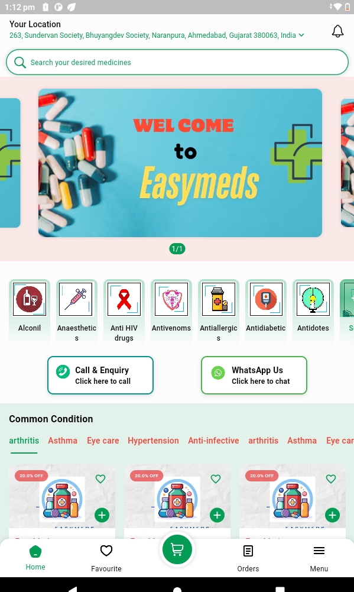
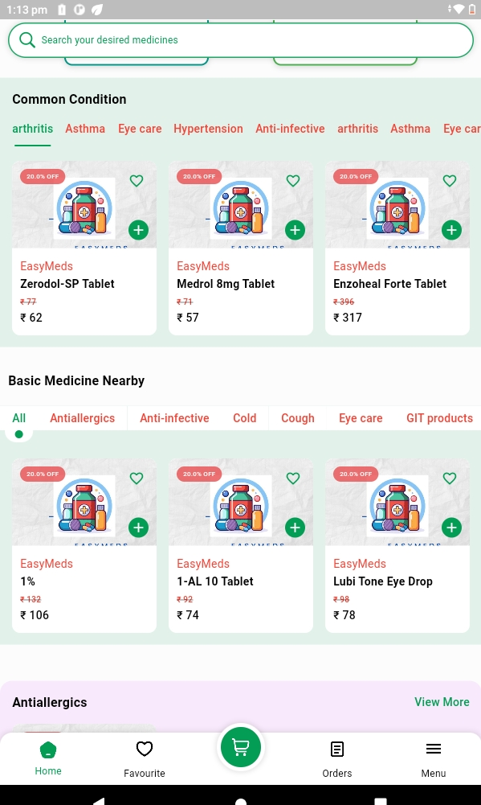
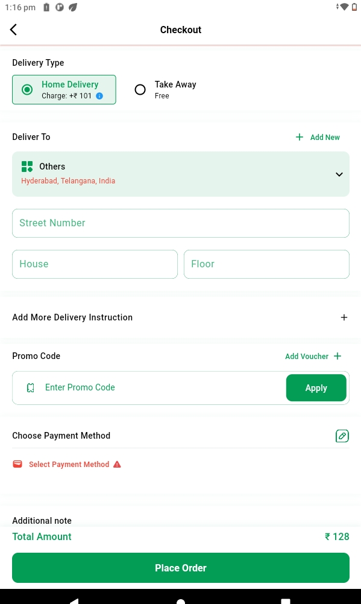
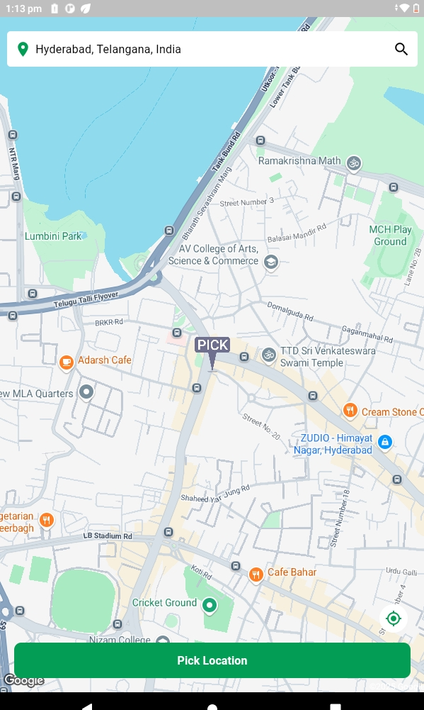
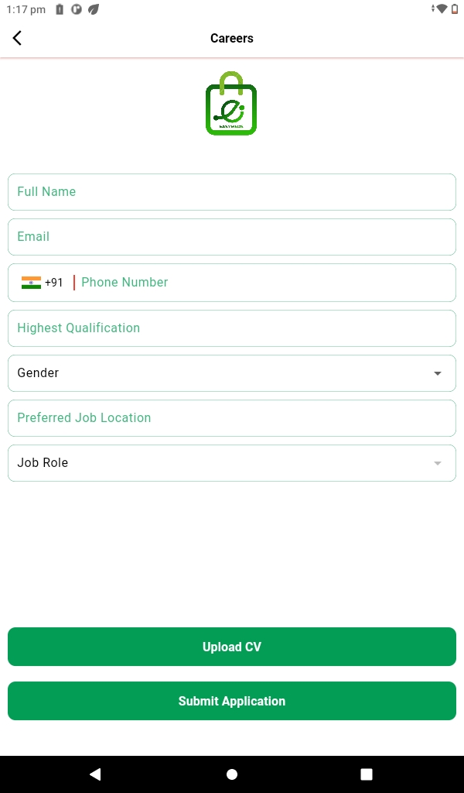
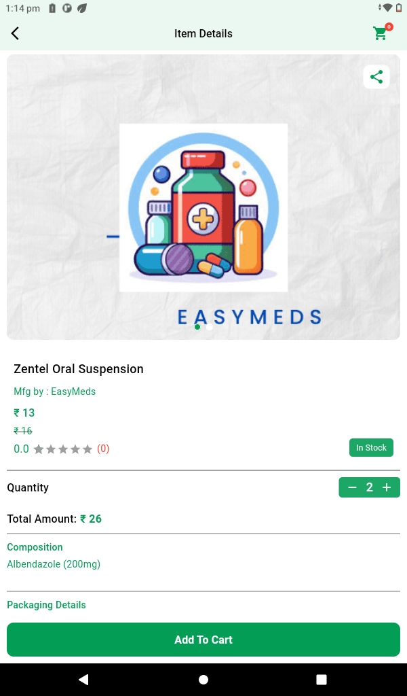
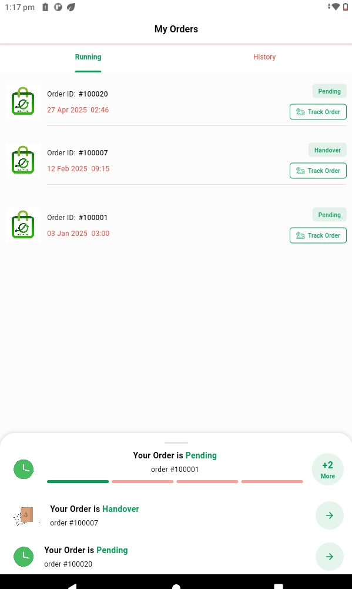
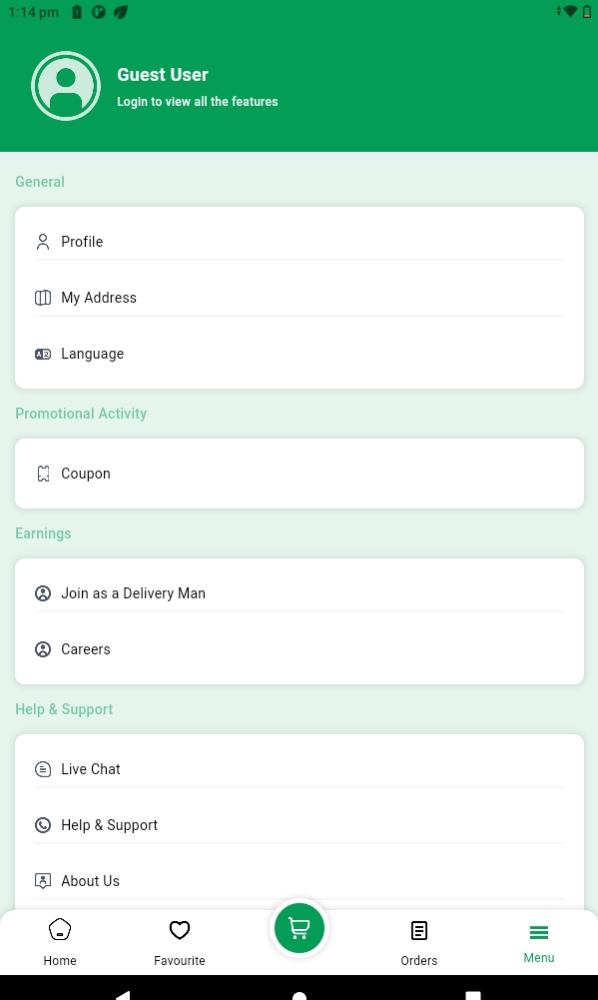
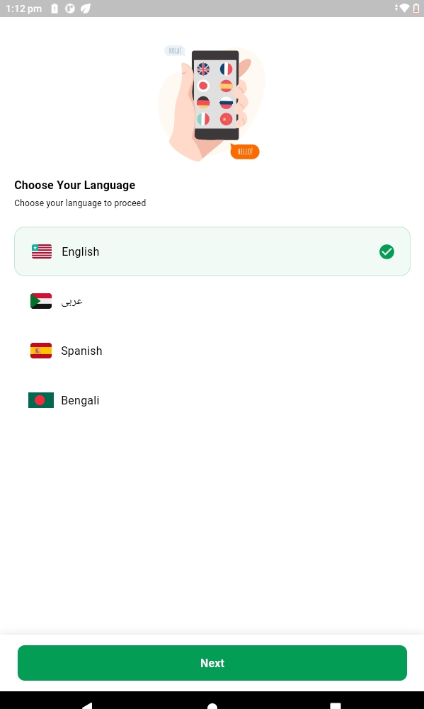

# 🚑 Medicine Delivery App

Your trusted partner for fast and reliable medicine delivery at your doorstep!

Select your location and instantly explore a wide range of pharmacies and healthcare stores nearby.  
Order your essential medicines or healthcare products with flexible payment options — choose Cash on Delivery (COD) or pay securely through our trusted payment gateway.

With hundreds of trained delivery agents ready to serve you, your health needs are just a few taps away.  
Place your order and get your medicines delivered quickly, safely, and hassle-free, right to your home!

---

# ✨ Key Features

- 🛒 **Browse Local Pharmacies:** Discover a wide range of stores based on your selected location.
- 💊 **Order Medicines Easily:** Search and order any medicine or healthcare product you need.
- 💳 **Multiple Payment Options:** Pay via safe payment gateway or opt for Cash on Delivery.
- 🚚 **Fast Delivery:** Hundreds of professional delivery agents are ready to dispatch your order instantly.
- 🔔 **Real-time Order Tracking:** Track your order from the pharmacy to your doorstep.
- 📝 **Upload Prescription:** Upload your doctor's prescription to order prescription-only medicines.
- 📅 **Schedule Deliveries:** Order now or schedule delivery for a later convenient time.
- 🔐 **Secure and Private:** Your medical details and transactions are 100% secure and confidential.

---

# 📸 App Screenshots

> Add screenshots in your project under `assets/screenshots/` folder and link them below 👇

### 🏠 Home Screen

### 🏥 Pharmacy List

### 🛒 Order Cart

### 🚚 Delivery Tracking

### 🚚 Location selection

### 🚚 Deliveryman join

### 🚚 Product info

### 🚚 Delivery Details

### 🚚 Menu Screen

### 🚚 Language Screen

---

# 🛡️ Why Choose Us?

- Trusted pharmacies and certified medicines
- Easy prescription uploads
- Lightning-fast delivery network
- 24/7 customer support for your health needs
- User-friendly and secure app experience

---

# 📥 Get Started

> **Install the app, find your medicine, and let us deliver wellness to your home!** 🌟

---

# ⚙️ Tech Stack

- **Flutter 3.27** (Cross-platform mobile development)
- **Firebase** (Authentication, Cloud Firestore, Notifications)
- **Stripe / Razorpay Payment Gateway** (Secure Payments)
- **Google Maps API** (Location and Delivery Tracking)

---

# 📄 License

This project is licensed under the MIT License - see the [LICENSE](LICENSE) file for details.

---

# 🔥 Short Tagline for App Store

_"Your health, delivered fast. Medicines at your doorstep in just a few taps!"_

# sixam_mart

A new Flutter application.

## Getting Started
## flutter sdk: 3.22.3

This project is a starting point for a Flutter application.

A few resources to get you started if this is your first Flutter project:

- [Lab: Write your first Flutter app](https://flutter.dev/docs/get-started/codelab)
- [Cookbook: Useful Flutter samples](https://flutter.dev/docs/cookbook)

For help getting started with Flutter, view our
[online documentation](https://flutter.dev/docs), which offers tutorials,
samples, guidance on mobile development, and a full API reference.
